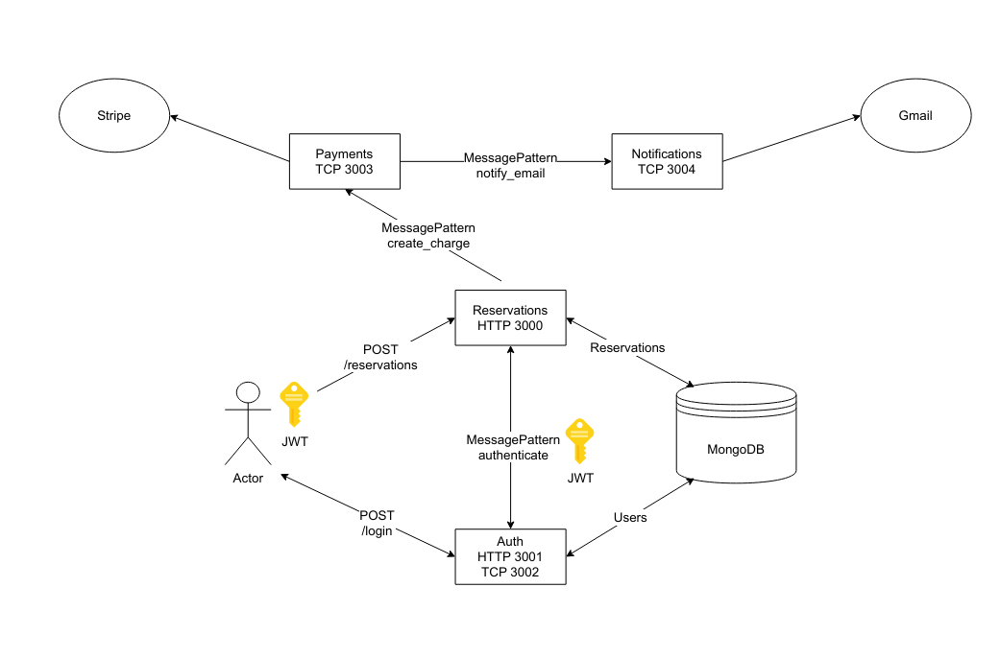

# Sleepr-api

This monorepo contains code of the backend of the sleepr-api. This application implements microservice architecture using Nest.js and utilizes the transports provided by it. Authentication, reservations, payments and notifications services are used to facilitate the overall application.

## System Architecture


In this application, Reservations microservice connects to Authentication, and transmits events or rpc calls to payments and notifications services. TCP transport is used in most of the cases, which can be easily switched to other transports like Rabbit MQ.

## Running the applications

The application is dockerized and so, to learn the application, we need docker engine installed in the system.

### Start the all the services

To start all the services in the ```detached``` mode, use the following command. The environment variables will be initialized by the docker compose file.

```bash
docker compose up -d
```

### Follow the logs

to follow the logs of a single services use the following command

```bash
docker logs -f application_name
```

### Stop all the services

To stop all the services, use the following command

```bash
docker compose down
```

## Credit

The codebase is mostly inspired by the Udemy course on [NestJS Microservices: Build & Deploy a Scaleable Backend](https://www.udemy.com/course/nestjs-microservices-build-deploy-a-scaleable-backend/?couponCode=KEEPLEARNING) by [Michael Guay](https://www.youtube.com/@mguay)
